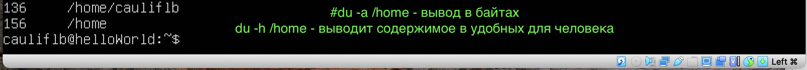
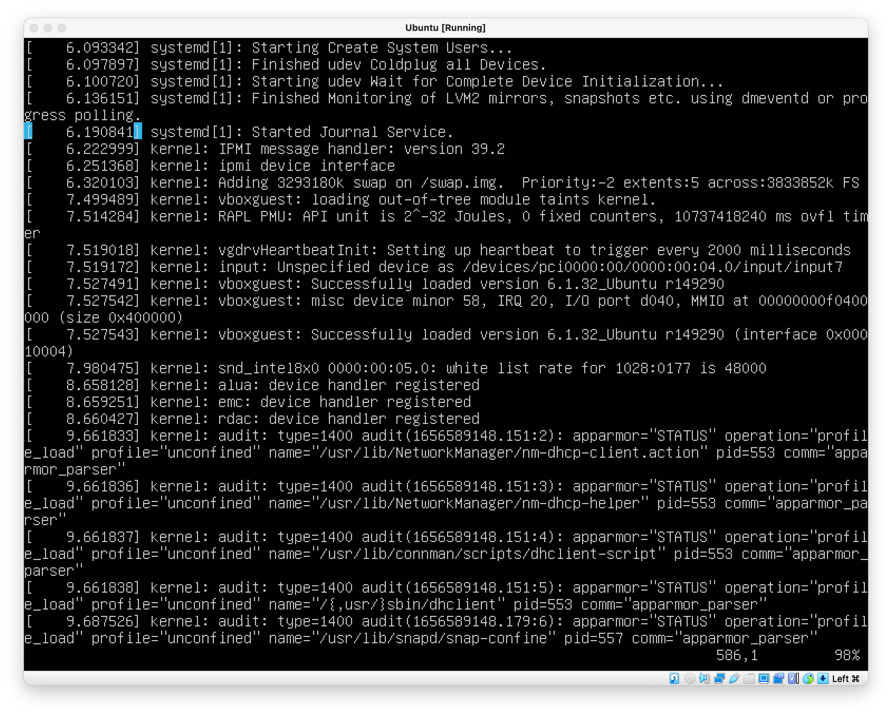

# Операционные системы UNIX/Linux (Базовый)
## Part 1. Установка ОС

Скачал и установил следующее ПО

- [VirtualBox]
- [Ubuntu Server 20.4 lts]


## Part 2. Создание пользователя

Создаем нового пользователя с определенной группой
```sh
sudo useradd -G adm <пользователь>
```
Ниже пример проверки, что такой пользователь существует в группе "adm"


Новый пользователь должен быть в выводе команды
```sh
cat /etc/passwd
```


Каждая  строка  представляет  одного  пользователя  и  состоит  из  семи  полей,  разделенных двоеточиями. Эти поля таковы.
- `Имя пользователя.`
- `Зашифрованный пароль пользователя.` В большинстве систем Linux пароль  в  действительности  не  хранится  в  файле  *passwd*,  а  помещается  в  файл  *shadow*  (см. подраздел 7.3.3). Формат файла *shadow* похож на формат файла *passwd*, однако  у обычных пользователей нет разрешения на чтение файла *shadow*. Второе поле  в файле *passwd* или *shadow* является зашифрованным паролем, он выглядит как  нечитаемый  набор  символов,  например  d1CVEWiB/oppc.  Пароли  в  системе  Unix  никогда не хранятся в виде простого текста.
Символ x во втором поле файла *passwd* говорит о том, что зашифрованный пароль  хранится в файле *shadow*. Звездочка (*) сообщает, что этот пользователь не может 
7.3. Файлы управления пользователями 179
совершать вход в систему, а если это поле пусто (то есть вы видите два двоеточия  подряд,  ::),  то  для  входа  в  систему  пароля  не  требуется.  Остерегайтесь  пустых  паролей. Никогда не следует регистрировать пользователя без пароля.
- `Идентификатор пользователя (UID)`, который представляет данного пользо­ вателя ядру. Можно создать две записи с одинаковым идентификатором поль­ зователя, но это будет сбивать с толку и вас, и ваше программное обеспечение.  Старайтесь использовать уникальные идентификаторы.
- `Идентификатор группы (GID)` представляет собой одну из нумерованных за­ писей в файле /etc/group. Группы задают права доступа к файлам и кое­что еще.  Данная группа называется также первичной группой пользователя.
- `Реальное имя пользователя` (часто называется полем GECOS). В этом поле вы  можете встретить запятые, которые отделяют номер комнаты и номер телефона.
- `Домашний каталог пользователя.`
- `Оболочка пользователя` (команда, которая запускается при работе пользовате­
ля в терминале).


## Part 3. Настройка сети ОС

**Задать название машины вида user-1**

Первоначальные настройки ПК были следующими:


```sh
sudo vim /etc/hostname
```

После редактирования файла и перезагрузки системы, *hostname* будет отображаться следующим образом:


**Установить временную зону, соответствующую вашему текущему местоположению.**

Первоначальный часовой пояс:


```sh
sudo timedatectl set-timezone <нужный часовой пояс>
```

Как теперь отображается часовой пояс, после установки:


**Вывести названия сетевых интерфейсов с помощью консольной команды.**


**Используя консольную команду получить ip адрес устройства, на котором вы работаете, от DHCP сервера.**

Понятие о протоколе DHCP

Когда вы настраиваете сетевой хост на автоматическое получение конфигурации из  сети, вы указываете ему, чтобы он использовал протокол DHCP (Dynamic Host  Configuration Protocol, протокол динамического конфигурирования хоста) для полу­ чения IP­адреса, маски подсети, шлюза по умолчанию и серверов DNS. Помимо того  что не приходится вводить эти параметры вручную, протокол DHCP обладает дру­ гими преимуществами для сетевого администратора, такими как предотвращение  конфликтов IP­адресов и минимизация последствий при изменении сети. Нечасто  можно встретить современную сеть, которая не использует протокол DHCP.
Чтобы хост получал свою конфигурацию с помощью протокола DHCP, он дол­ жен быть способен отправлять сообщения DHCP­серверу той сети, к которой он  подключен. Следовательно, каждая физическая сеть должна обладать собственным  DHCP­сервером, а в простой сети его роль обычно выполняет маршрутизатор.
Когда  компьютер  запрашивает  IP­адрес  у  сервера  DHCP,  на  самом  деле  он  просит  об  *аренде*  этого  адреса  на  некоторое  время.  Когда  аренда  заканчивается,  клиент может запросить обновление аренды.


**Определить и вывести на экран внешний ip-адрес шлюза (ip) и внутренний IP-адрес шлюза, он же ip-адрес по умолчанию (gw).**

Внутренний ip адрес


Внешний ip адрес. Пример, как видят тебя внешние сайты.


**Задать статичные (заданные вручную, а не полученные от DHCP сервера) настройки ip, gw, dns (использовать публичный DNS серверы, например 1.1.1.1 или 8.8.8.8).**


## Part 4. Обновление ОС

Перед обновлением необходимо выполнить команду `apt-get update`, которая обновит информацию о пакетах, содержащихся в репозиториях, чтобы в процессе обновления получить самые последние версии пакетов.

Далее обновляем через `dist-upgrade`. Делает тоже самое, что `upgrade` плюс выполяет «умное» разрешения конфликтов версий пакетов. При конфликтах пакетов Ubuntu попытается обновите наиболее важные пакеты за счет менее важных. Поэтому команда `dist-upgrade` может установить дополнительные пакеты или удалить один из конфликтующих пакетов.


## Part 5. Использование команды sudo

Sudo - это аналог выполнения какой-либо команды от имени администратора.


## Part 6. Установка и настройка службы времени

Данную задачу я проделал ранее. Проверка ниже:


## Part 7. Установка и использование текстовых редакторов

**Установить текстовые редакторы VIM (+ любые два по желанию NANO, MCEDIT, JOE и т.д.)**

Используя каждый из трех выбранных редакторов, создайте файл test_X.txt, где X -- название редактора, в котором создан файл. Напишите в нём свой никнейм, закройте файл с сохранением изменений.

**NANO**


**JOE**


**MCEDIT**


Используя каждый из трех выбранных редакторов, откройте файл на редактирование, отредактируйте файл, заменив никнейм на строку "21 School 21", закройте файл без сохранения изменений.

**NANO**


**JOE**


**MCEDIT**


Используя каждый из трех выбранных редакторов, отредактируйте файл ещё раз (по аналогии с предыдущим пунктом), а затем освойте функции поиска по содержимому файла (слово) и замены слова на любое другое.

**NANO**


**JOE**


**MCEDIT**


## Part 8. Установка и базовая настройка сервиса SSHD

**Установить службу SSHd.**

В моем случае, данный пакет уже был установлен.


**Добавить автостарт службы при загрузке системы.**


**Перенастроить службу SSHd на порт 2022.**


Чтобы отредактировать настройки службы, нужно зайти в следующий файл:
```sh
sudo vim /etc/ssh/sshd_config
```


**Используя команду ps, показать наличие процесса sshd. Для этого к команде нужно подобрать ключи.**


## Part 9. Установка и использование утилит top, htop

Для установки, используйте следующую команду.

```sh
sudo apt install top
```
Пример как работает программа.


- uptime = 1:28
- количество авторизованных пользователей = 1
- общую загрузку системы = 0.0
- общее количество процессов  = 93
- загрузку cpu = 0.0
- загрузку памяти = 148.2
- pid процесса занимающего больше всего памяти = 1393
- pid процесса, занимающего больше всего процессорного времени = 1

Для установки, используйте следующую команду.

```sh
sudo apt install htop
```
Пример как работает сортировка.


Фильтр для процесса sshd.


C процессом syslog, найденным, используя поиск


## Part 10. Использование утилиты fdisk


## Part 11. Использование утилиты df


## Part 12. Использование утилиты du

Чтобы просто вывести список папок в определённом каталоге и занимаемое ими место, например, в /var выполните:

```sh
du <опция> <путь к папке>
```



## Part 13. Установка и использование утилиты ncdu

Установить утилиту ncdu.


Вывести размер папок /home, /var, /var/log.


## Part 14. Работа с системными журналами




Перезапустить службу SSHd.


## Part 15. Использование планировщика заданий CRON


[//]: # (These are reference links used in the body of this note and get stripped out when the markdown processor does its job. There is no need to format nicely because it shouldn't be seen. Thanks SO - http://stackoverflow.com/questions/4823468/store-comments-in-markdown-syntax)

   [VirtualBox]: <https://www.virtualbox.org/>
   [Ubuntu Server 20.4 lts]: <https://ubuntu.com/download/server>
