# Сети Linux
###### (C) Кабацюра Дмитрий [cauliflb]
## Part 1. Инструмент ipcalc

#### 1.1. Сети и маски.

ipcalc — калькулятор для расчета сетей
Маленькая и удобная утилитка по расчету сетевых адресов, все в цвете и красиво.

Определить и записать в отчёт:

1) Адрес сети 192.167.38.54/13

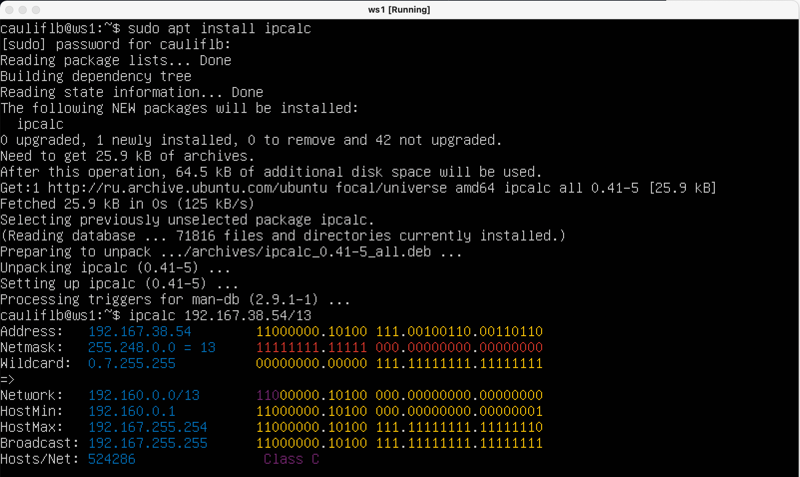

2) Перевод маски 255.255.255.0 в префиксную и двоичную запись,
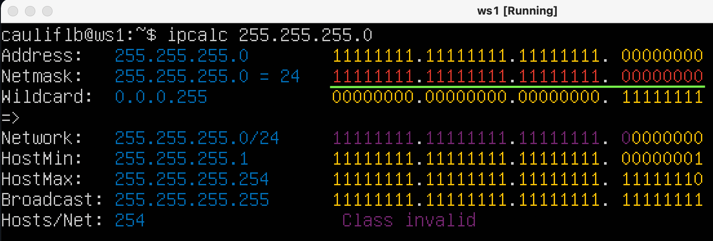

/15 в обычную и двоичную, 
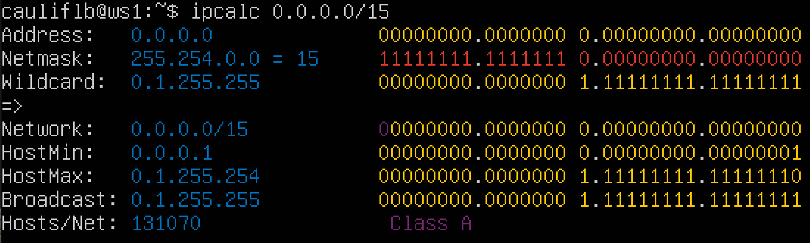

11111111.11111111.11111111.11110000 в обычную и префиксную
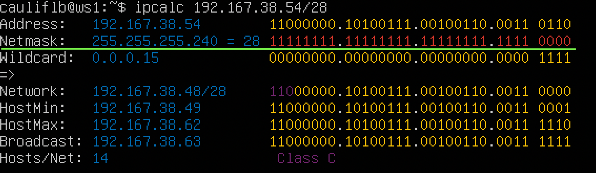

3) Минимальный и максимальный хост в сети 12.167.38.4 при масках: /8, 11111111.11111111.00000000.00000000, 255.255.254.0 
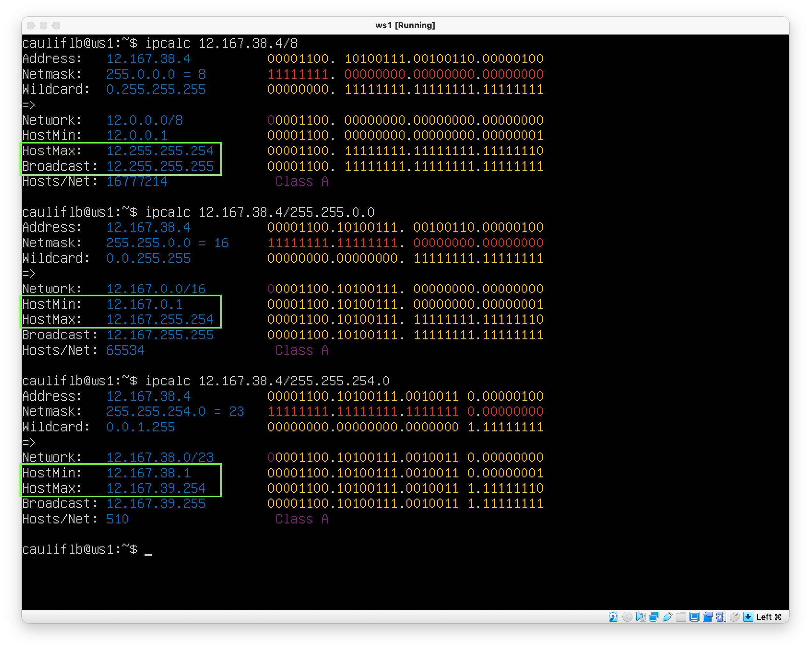

и /4

#### 1.2. localhost

Определить и записать в отчёт, можно ли обратиться к приложению, работающему на localhost, со следующими IP: 194.34.23.100, 127.0.0.2, 127.1.0.1, 128.0.0.1

##### Немного теории

Так что же значит localhost?
В компьютерной сети локалхост относится к компьютеру, на котором запущена программа. Компьютер работает как виртуальный сервер. В этом смысле компьютер — это не физический объект, а система, которая работает внутри. Если это трудно понять, рассмотрите localhost как способ «позвонить» вашему компьютеру в контексте работы в сети.

127.0.0.1/loopback address
Localhost — это не только термин, но и доменное имя, например google.com или wikipedia.org. Это адрес. Если при вводе google.com в браузере вы попадете на главную страницу Google, куда вас доставит localhost? Он приведёт вас к вашему компьютеру. Эта ситуация также известна как адрес обратной связи.

Как и любое другое доменное имя, localhost также имеет IP-адрес (интернет-протокол). Адрес варьируется от 127.0.0.0 до 127.255.255.255, но обычно это 127.0.0.1. Попытка открыть 127.0.0.1 в соединении IPv4 вызовет обратную петлю. Вы также можете запустить петлю в соединении IPv6, введя: 1.

Интересный факт: первая часть адреса — 127 — зарезервирована только для петель. По этой причине Transmission Control Protocol и Internet Protocol (TCP/IP) немедленно распознают, что вы хотите связаться с вашим компьютером после ввода любого адреса, начинающегося с этих номеров. Вот почему ни один веб-сайт не может иметь IP-адрес, который начинается со 127. Если это сделать, это действие создаст устройство обратной связи; который является виртуальным интерфейсом внутри операционной системы вашего компьютера.

##### задание

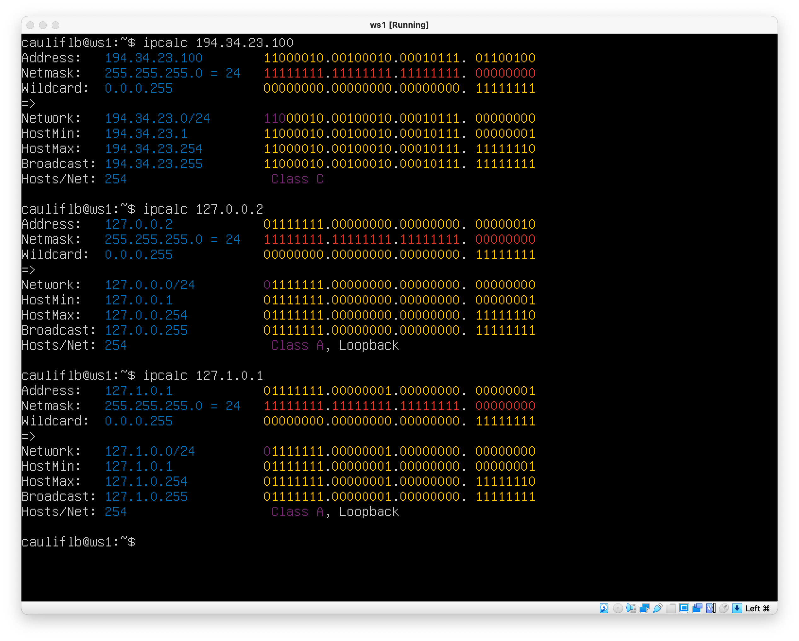
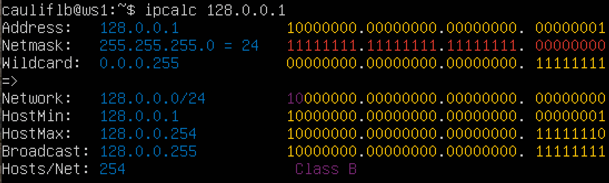
, где loopback петля, т.е. ПО понимает, что мы обращаемся к localhost

#### 1.3. Диапазоны и сегменты сетей

Определить и записать в отчёт:

1) какие из перечисленных IP можно использовать в качестве публичного, а какие только в качестве частных: 10.0.0.45, 134.43.0.2, 192.168.4.2, 172.20.250.4, 172.0.2.1, 192.172.0.1, 172.68.0.2, 172.16.255.255, 10.10.10.10, 192.169.168.1

Определял с помощью утилиты `ipcalc`
Примеры:
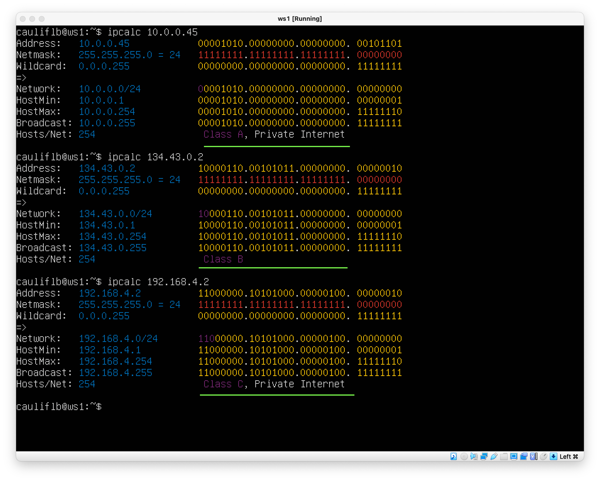

| Public        | Private       |
| ------------- |---------------|
| 134.43.0.2    | 10.0.0.45     |
| 172.0.2.1     | 192.168.4.2   |
| 192.172.0.1   | 172.20.250.4  |
| 172.68.0.2    | 172.16.255.255|
| 192.169.168.1 | 10.10.10.10   |

2) какие из перечисленных IP адресов шлюза возможны у сети 10.10.0.0/18: 10.0.0.1, 10.10.0.2, 10.10.10.10, 10.10.100.1, 10.10.1.255
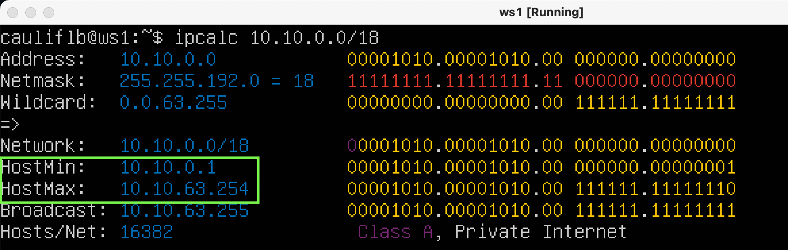

| Возможны      | НЕ возможны   |
| ------------- |---------------|
| 10.10.0.2     | 10.0.0.1      |
| 10.10.10.10   | 10.10.100.1   |
| 10.10.1.255   |               |

## Part 2. Статическая маршрутизация между двумя машинами

Поднять две виртуальные машины (далее -- ws1 и ws2)
С помощью команды ip a посмотреть существующие сетевые интерфейсы
*В отчёт поместить скрин с вызовом и выводом использованной команды.*
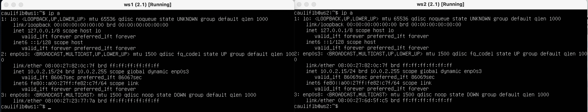

Описать сетевой интерфейс, соответствующий внутренней сети, на обеих машинах и задать следующие адреса и маски: ws1 - 192.168.100.10, маска /16, ws2 - 172.24.116.8, маска /12
*В отчёт поместить скрины с содержанием изменённого файла etc/netplan/00-installer-config.yaml для каждой машины.*

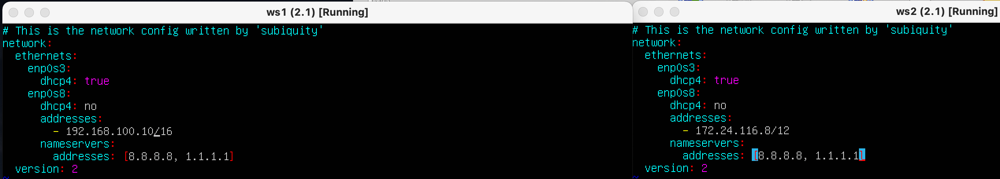

Выполнить команду `netplan apply` для перезапуска сервиса сети
*В отчёт поместить скрин с вызовом и выводом использованной команды.*
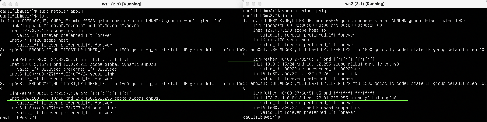

#### 2.1. Добавление статического маршрута вручную

Добавить статический маршрут от одной машины до другой и обратно при помощи команды вида ip r add

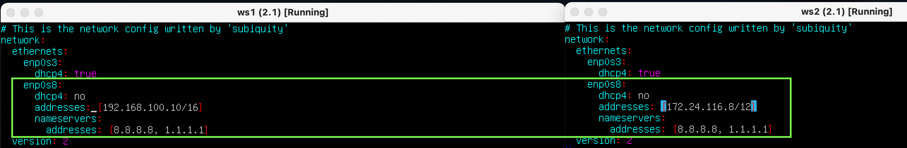

Пропинговать соединение между машинами
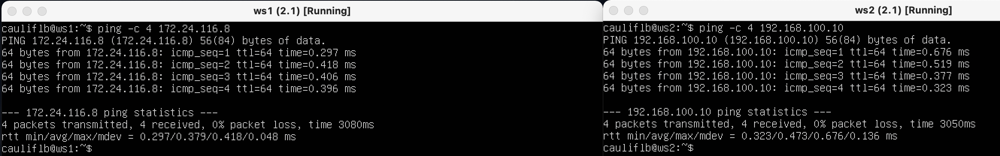

#### 2.2. Добавление статического маршрута с сохранением

Перезапустим машины через `sudo reboot`

Добавить статический маршрут от одной машины до другой с помощью файла etc/netplan/00-installer-config.yaml
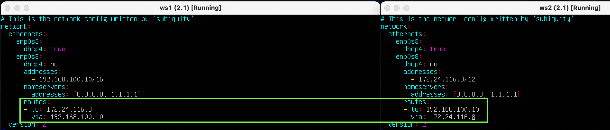
Пропинговать соединение между машинами
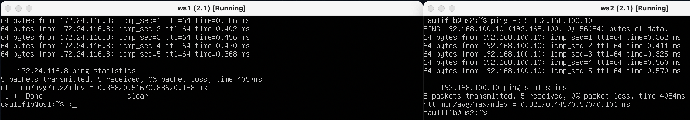

## Part 3. Утилита iperf3

Утилита iperf - это генератор сетевого трафика, предназначенный для проверки скорости и пропускной способности сети. Программа кроссплатформена, и распространяется с открытым исходным кодом. Вы можете использовать её для проверки пропускной способности VPS серверов или для настройки и улучшения производительности сети.

Устанавливаем командой `sudo apt install iperf3`

Поскольку утилита имеет как серверную часть так и клиентскую, надо рассматривать обе отдельно. Для запуска сервера используется такой синтаксис:

`$ iperf3 -s опции`

Для запуска клиента используется ключ -c, которому надо передать адрес сервера:

`$ iperf3 -c адрес_сервера опции`

[Ссылка на статью тут.](https://losst.ru/kak-polzovatsya-iperf)

#### 3.1. Скорость соединения

Перевести и записать в отчёт: 8 Mbps в MB/s, 100 MB/s в Kbps, 1 Gbps в Mbps

| Convert from | to Decimal SI (base 10) | to Binary (base 2) |
| ------------ |-------------------------|--------------------|
| 8 Mbps       | 1 MB/s                  | 1 MB/s             |
| 100 MB/s     | 100 000 KB              | 102 400 Kbps       |
| 1 Gbps       | 1 000 MB                | 1 024 Mbps         |

[Ссылка на конвертер](https://www.gbmb.org/mbps-to-mbs)

#### 3.2. Утилита iperf3

Измерить скорость соединения между ws1 и ws2.
В моём случае, ws1 использовался как сервер, а ws2 являлась клиентом. 
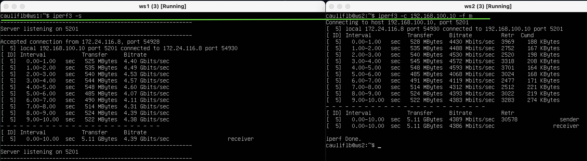

## Part 4. Сетевой экран

#### 4.1. Утилита iptables
Создать файл /etc/firewall.sh, имитирующий фаерволл, на ws1 и ws2.
##### немного теории

В операционной системе Linux в ядро встроен очень гибкий и надежный фаервол iptables. Именно с помощью этой программы выполняется защита системы от внешних вторжений, перенаправление портов, а также еще очень много действий с трафиком.Все сетевые пакеты, которые проходят через компьютер, отправляются компьютером или предназначены компьютеру, ядро направляет через фильтр iptables. Там эти пакеты поддаются проверкам и затем для каждой проверки, если она пройдена выполняется указанное в ней действие. Например, пакет передается дальше ядру для отправки целевой программе, или отбрасывается.

Подсистема iptables и netfilter встроены в ядро, но вот набор утилит для управления всем этим не всегда поставляется вместе с системой. Для установки утилиты в Ubuntu нужно набрать: `sudo apt install iptables`

В фильтре iptables все пакеты делятся на три аналогичные цепочки:

**Input** - обрабатывает входящие пакеты и подключения. Например, если какой-либо внешний пользователь пытается подключиться к вашему компьютеру по ssh или любой веб-сайт отправит вам свой контент по запросу браузера. Все эти пакеты попадут в эту цепочку;
**forward** - эта цепочка применяется для проходящих соединений. Сюда попадают пакеты, которые отправлены на ваш компьютер, но не предназначены ему, они просто пересылаются по сети к своей цели. Такое наблюдается на маршрутизаторах или, например, если ваш компьютер раздает wifi;
**output** - эта цепочка используется для исходящих пакетов и соединений. 

[Подробная статья](https://losst.ru/nastrojka-iptables-dlya-chajnikov)

Напишем правила для машин.
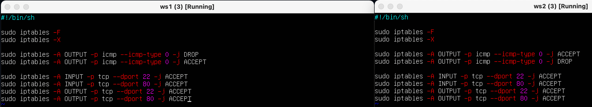

Применим правила. Запустим файлы на обеих машинах командами `sudo chmod +x /etc/firewall.sh` и `/etc/firewall.sh`.
Отобразим записанные правила `sudo iptables -L`.
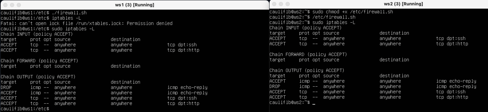

## 4.2. Утилита nmap

Устанавливаем утилиту через `sudo apt install nmap`

Через `ping` видим, что от 1й машины мы не получаем исходящие пакеты. А всё потому, что действует первое правило примененное в файле из предыдущего пункта.
Используем команду `nmap`, чтобы показать, что она включена.
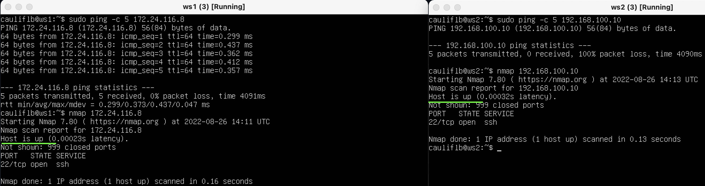

# Part 5. Статическая маршрутизация сети

## 5.1 Строим следующую сеть:

Настроить конфигурации машин в etc/netplan/00-installer-config.yaml согласно сети на рисунке.

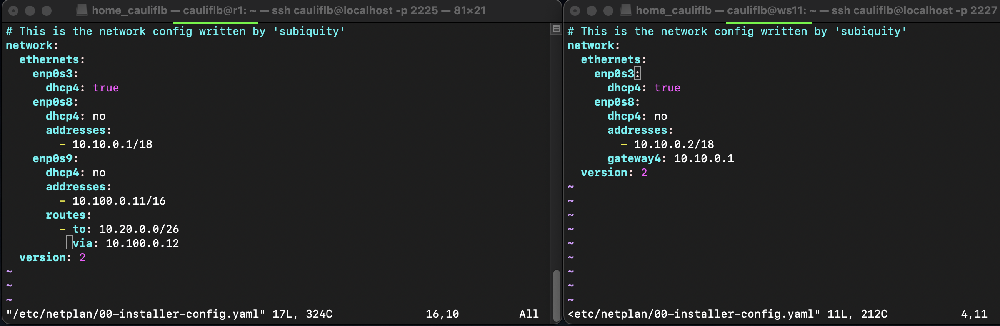
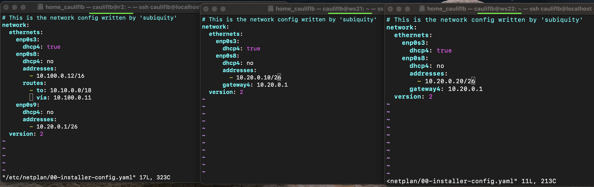

Перезапустить сервис сети. Если ошибок нет, то командой ip -4 a проверить, что адрес машины задан верно.
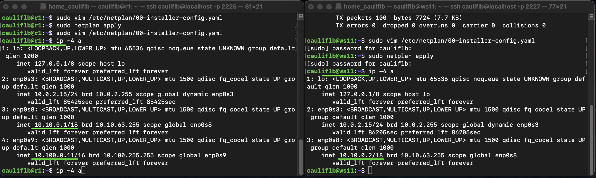

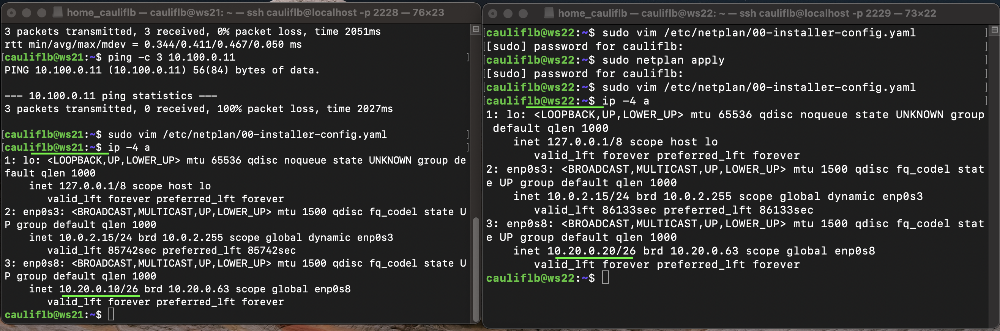

Также пропинговать ws22 с ws21 (скрин справа). Аналогично пропинговать r1 с ws11 (скрин слева).
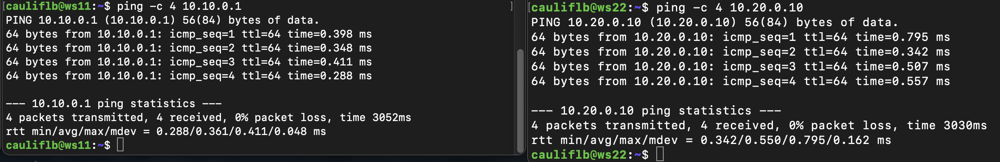

## 5.2. Включение переадресации IP-адресов.

Для включения переадресации IP, выполните команду на роутерах:
`sysctl -w net.ipv4.ip_forward=1`
При таком подходе переадресация не будет работать после перезагрузки системы.

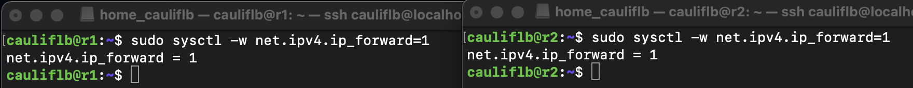

Откройте файл `sudo vim /etc/sysctl.conf` и добавьте в него следующую строку:
`net.ipv4.ip_forward = 1`
При использовании этого подхода, IP-переадресация включена на постоянной основе.
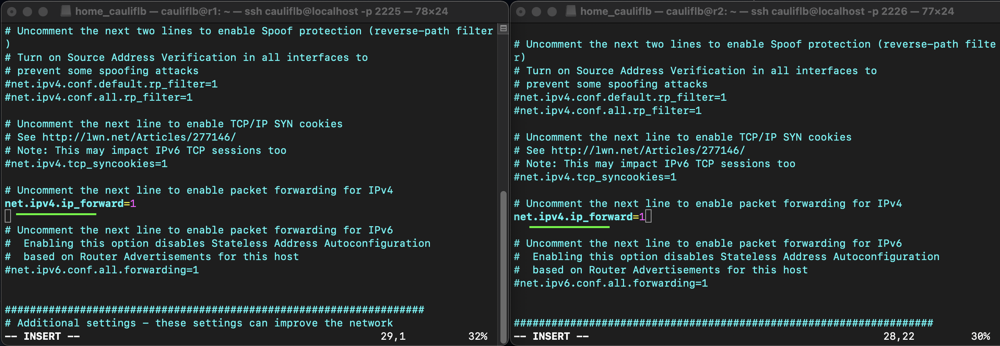

## 5.3. Установка маршрута по-умолчанию

Настроим шлюз для рабочих станций.
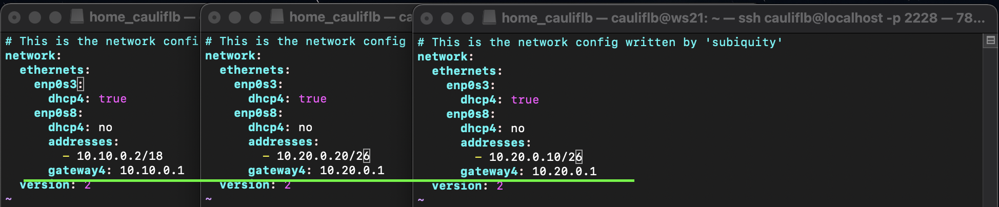

С помощью `ip r` смотрим, что добавились маршруты в таблицы маршрутизации.
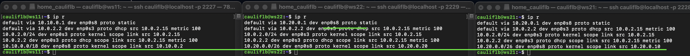

Пропинговать с ws11 роутер r2 и показать на r2, что пинг доходит. Для этого использовать команду:

Пример:
`sudo tcpdump -tn -i enp0s8`

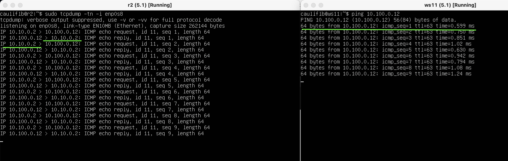

## 5.4. Добавление статических маршрутов

Добавить в роутеры r1 и r2 статические маршруты в файле конфигураций.

> я с первого пункта ранее прописал статистические маршруты.

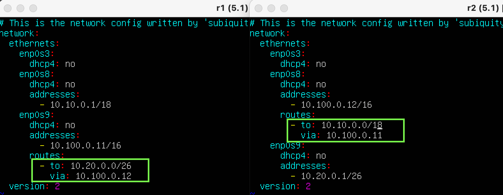

Вызвать ip r и показать таблицы с маршрутами на обоих роутерах.
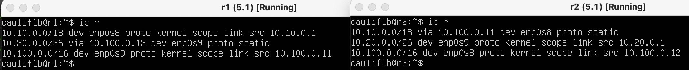

###### Запустить команды на ws11:
`ip r list 10.10.0.0/[маска сети]` и `ip r list 0.0.0.0/0`

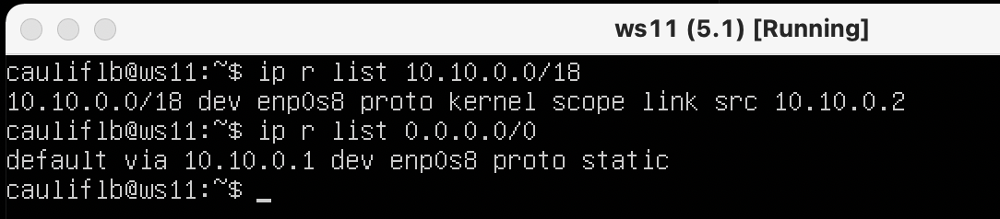

Для 10.10.0.0/[маска сети] был выбран маршрут, который указан явно. 
Для 0.0.0.0 не указано явного машрута, поэтому выбирается маршрут по-умолчанию.

## 5.5. Построение списка маршрутизаторов

Запустить на r1 команду дампа:
`tcpdump -tnv -i eth0`

При помощи утилиты traceroute построить список маршрутизаторов на пути от ws11 до ws21

Утилита ping позволяет только определить наличие проблемы, что узел не отвечает, но как узнать где обрывается соединение? Для этого применяется утилита traceroure.
В данном случае, мы пройдемся по каждому узлу и проверим, передаются ли пакеты. 

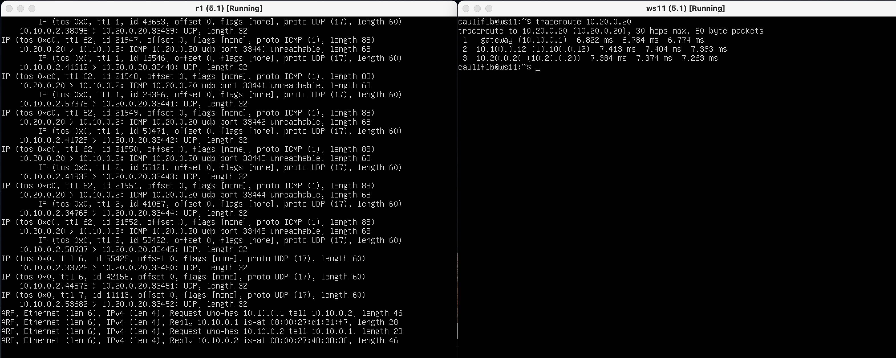

Как видно из скриншота, всё прошло успешно.

Каждый пакет проходит на своем пути определенное количество узлов, пока достигнет своей цели. Причем, каждый пакет имеет свое время жизни. Это количество узлов, которые может пройти пакет перед тем, как он будет уничтожен. Этот параметр записывается в заголовке TTL, каждый маршрутизатор, через который будет проходить пакет уменьшает его на единицу. При TTL=0 пакет уничтожается, а отправителю отсылается сообщение Time Exceeded.

Команда traceroute linux использует UDP пакеты. Она отправляет пакет с TTL=1 и смотрит адрес ответившего узла, дальше TTL=2, TTL=3 и так пока не достигнет цели. Каждый раз отправляется по три пакета и для каждого из них измеряется время прохождения. Пакет отправляется на случайный порт, который, скорее всего, не занят. Когда утилита traceroute получает сообщение от целевого узла о том, что порт недоступен трассировка считается завершенной.

## 5.6. Использование протокола ICMP при маршрутизации

Запустить на r1 перехват сетевого трафика, проходящего через eth0 с помощью команды:
tcpdump -n -i eth0 icmp

Пропинговать с ws11 несуществующий IP (например, 10.30.0.111) с помощью команды:
ping -c 1 10.30.0.111

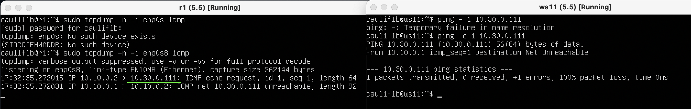

# Part 6. Динамическая настройка IP с помощью DHCP

Установка `sudo apt-get install isc-dhcp-server`

##### Для r2 настроить в файле /etc/dhcp/dhcpd.conf конфигурацию службы DHCP:

1) указать адрес маршрутизатора по-умолчанию, DNS-сервер и адрес внутренней сети. Пример файла для r2:
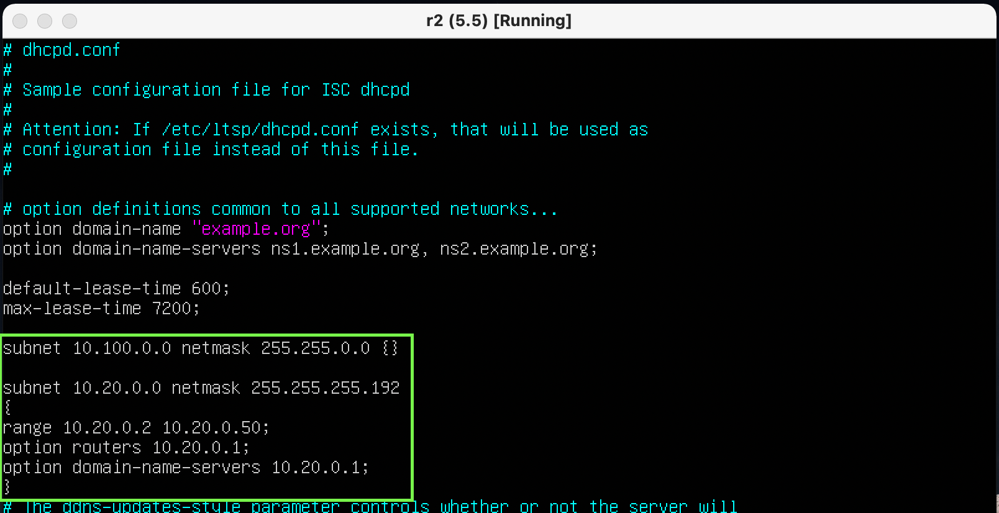
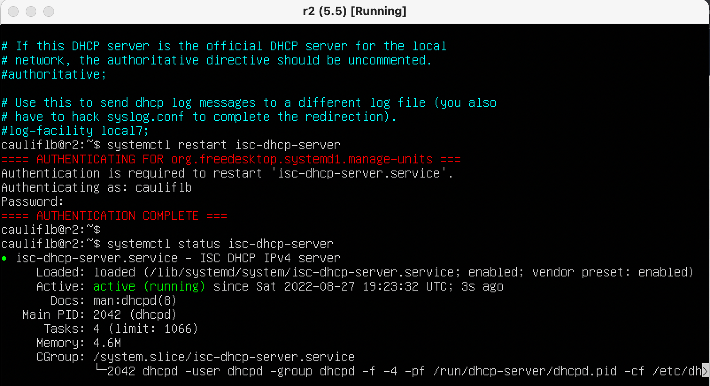

2) в файле `/etc/resolv.conf` прописать `nameserver 8.8.8.8.`
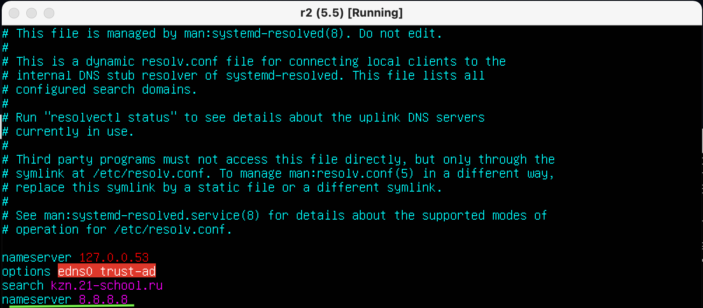

Перезагрузить службу DHCP командой `systemctl restart isc-dhcp-server`. 
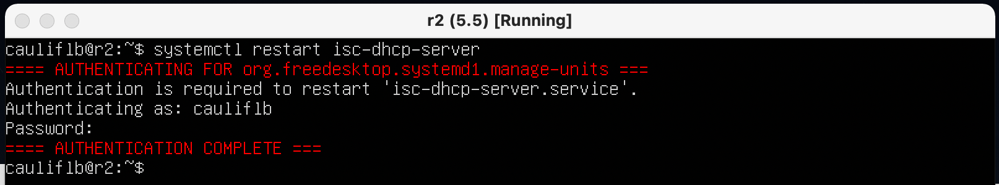

Машину ws21 перезагрузить при помощи reboot и через ip a показать, что она получила адрес. 
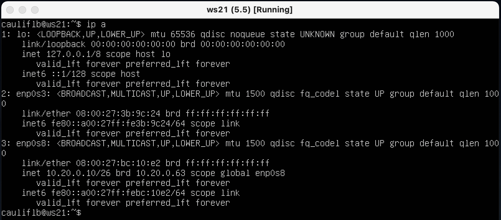

Также пропинговать ws22 с ws21.
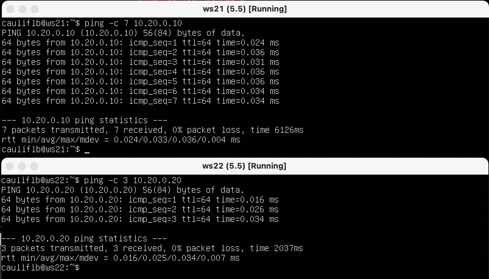

Указать MAC адрес у ws11, для этого в etc/netplan/00-installer-config.yaml надо добавить строки: macaddress: 10:10:10:10:10:BA, dhcp4: true

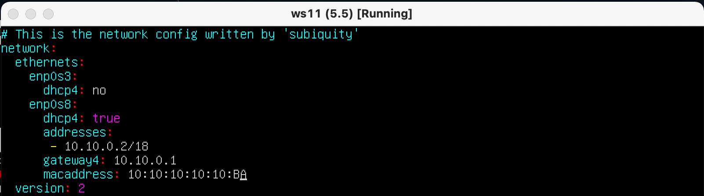
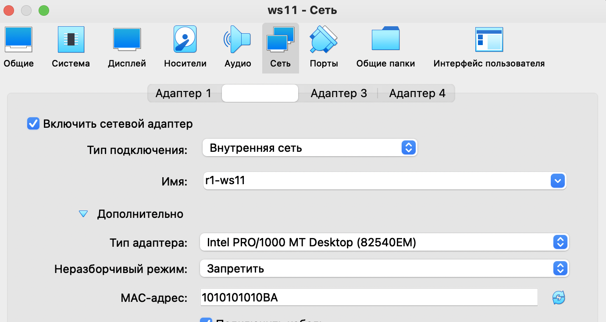

##### Для r1 настроить аналогично r2, но сделать выдачу адресов с жесткой привязкой к MAC-адресу (ws11). Провести аналогичные тесты.

1) Установка `sudo apt-get install isc-dhcp-server`

2) Далее, меняем настройки `sudo vim /etc/dhcp/dhcpd.conf`
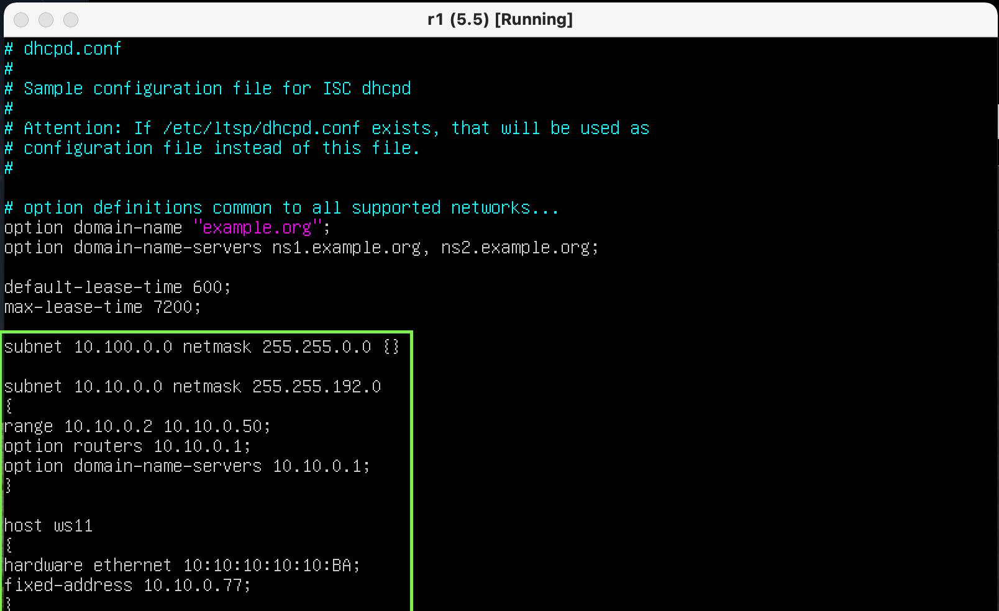
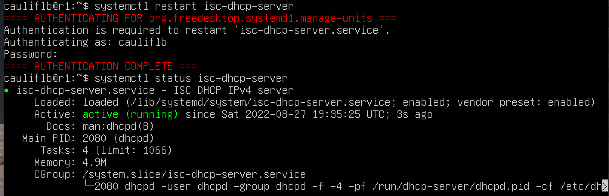
***Здесь я задал другой адрес для машины. Для того, чтобы показать как работает.***

3) в файле `/etc/resolv.conf` прописать `nameserver 8.8.8.8.`
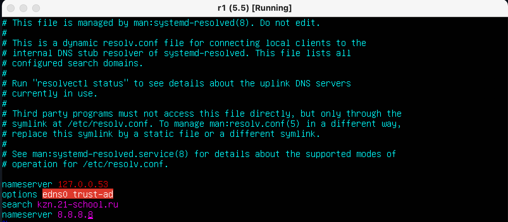

Запросить с ws21 обновление ip адреса.
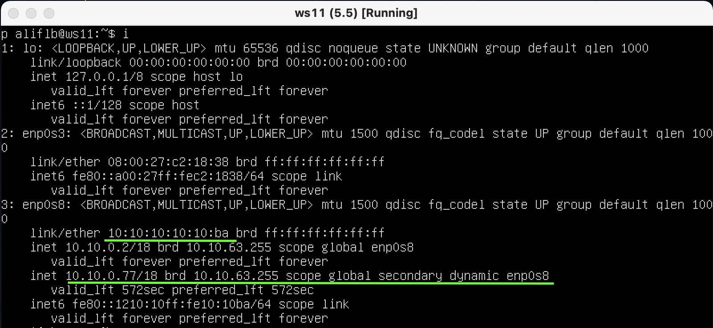

# Part 7. NAT

Для начала, установим `sudo apt install apache2`.

После завершения установки нужно добавить веб-сервер в автозагрузку, чтобы не запускать его вручную после включения компьютера:
`sudo systemctl enable apache2`

В файле /etc/apache2/ports.conf на ws22 и r1 изменить строку Listen 80 на Listen 0.0.0.0:80, то есть сделать сервер `Apache2` общедоступным.
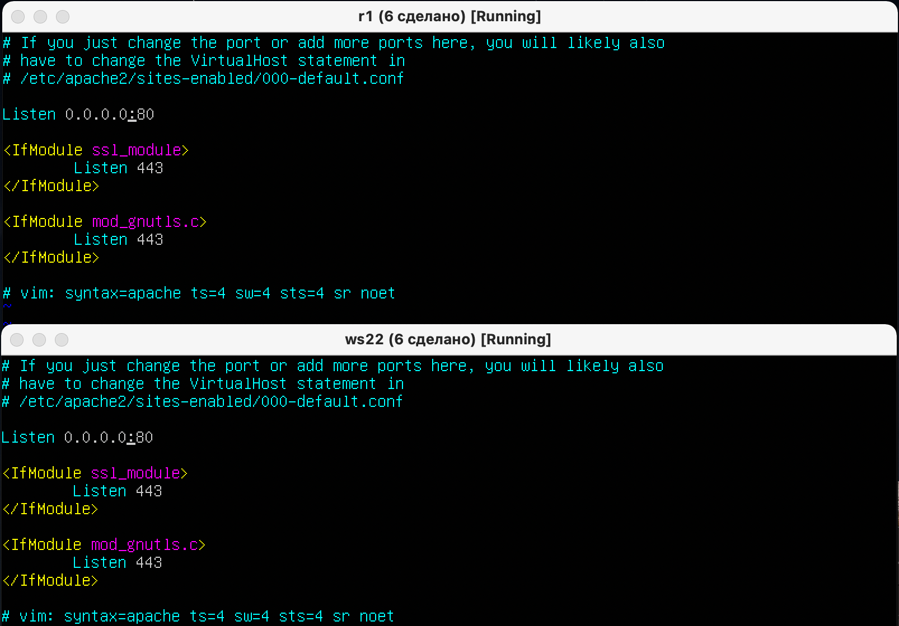

Запустить веб-сервер Apache командой service apache2 start на ws22 и r1.
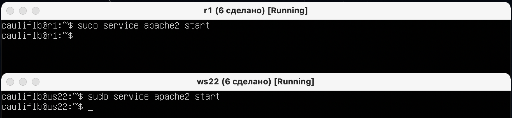

Добавим в фаервол, созданный по аналогии с фаерволом из Части 4, на r2 следующие правила:

1) Удаление правил в таблице `filter - iptables -F`
2) Удаление правил в таблице "NAT" `- iptables -F -t nat`
3) Отбрасывать все маршрутизируемые пакеты `- iptables --policy FORWARD DROP`

Запустим файл также, как в Части 4.
Применим правила. Запустим файлы на обеих машинах командами `sudo chmod +x /etc/firewall.sh` и `/etc/firewall.sh`.
Отобразим записанные правила `sudo iptables -L`.
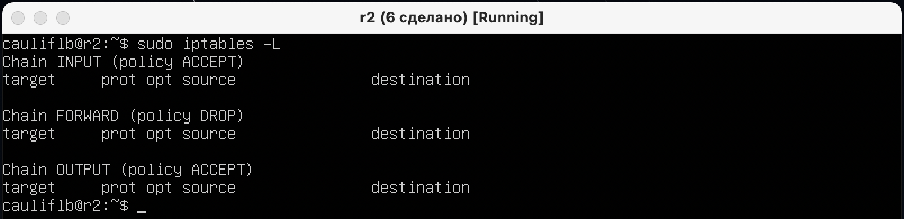

Проверим соединение между ws22 и r1 командой `ping`
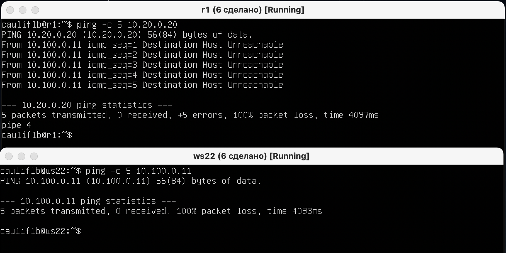
##### При запуске файла с этими правилами, ws22 не должна "пинговаться" с r1

4) Разрешить маршрутизацию всех пакетов протокола ICMP
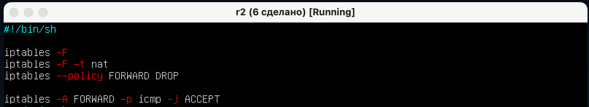

Запускать файл также, как в Части 4
Проверить соединение между ws22 и r1 командой ping

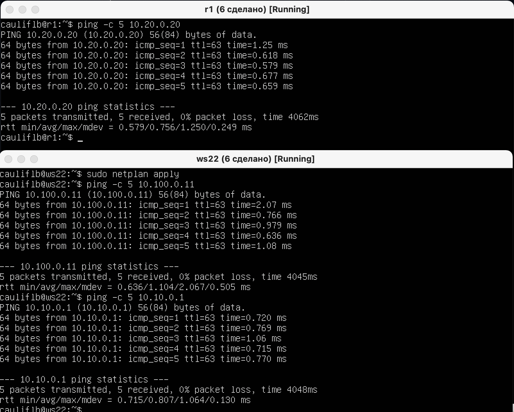
##### При запуске файла с этими правилами, ws22 должна "пинговаться" с r1

Добавить в файл ещё два правила:

**SNAT** — это изменение исходного адреса в заголовке пакета. Основное применение — использование единственного реального IP-адреса несколькими компьютерами для выхода в Интернет.

**DNAT** — от англ. Destination Network Address Translation — Изменение Сетевого Адреса Получателя. DNAT — это изменение адреса назначения в заголовке пакета. Зачастую используется в паре с SNAT. Основное применение — использование единственного реального IP-адреса несколькими компьютерами для выхода в Интернет и предоставления дополнительных сетевых услуг внешним клиентам.

[Хорошая статья на habr.com](https://habr.com/ru/sandbox/18975/)

5) Включить SNAT, а именно маскирование всех локальных ip из локальной сети, находящейся за r2 (по обозначениям из Части 5 - сеть 10.20.0.0)
6) Включить DNAT на 8080 порт машины r2 и добавить к веб-серверу Apache, запущенному на ws22, доступ извне сети
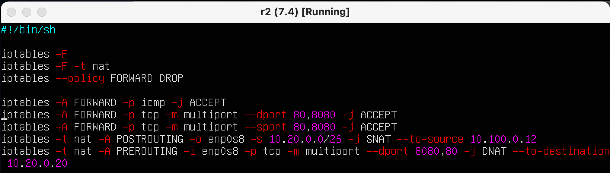

**Проверить соединение по TCP для SNAT, для этого с ws22 подключиться к серверу Apache на r1 командой:**
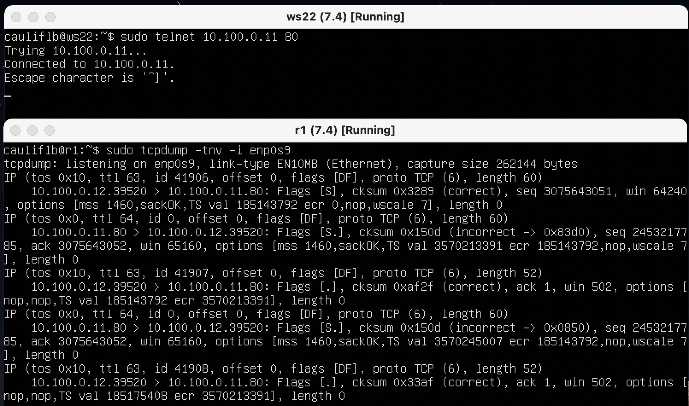

**Проверить соединение по TCP для DNAT, для этого с r1 подключиться к серверу Apache на ws22 командой telnet (обращаться по адресу r2 и порту 8080)**

Прежде чем начать проверку соединения ws22 через порт 8080, мы должны задать настройки для этого порта:
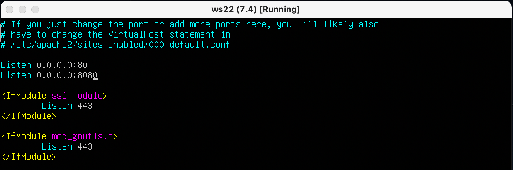

Далее перезапускаем apache 2 и проверяем статус:
`sudo service apache2 restart`
`sudo service apache2 status`

После уже можем проверять соединение:
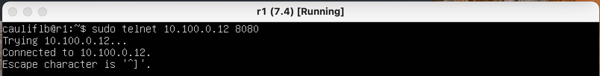

## Part 8. Дополнительно. Знакомство с SSH Tunnels

**ТУННЕЛИ SSH**
С помощью SSH туннелей вы можете пробросить порт с удалённого сервера на локальную машину. Это очень полезно, в первую очередь, для разработчиков. Для того чтобы пробросить порт с удалённой машины локальной используйте опцию -L и такой синтаксис:

`$ ssh -L локальный_порт:удаленный_адрес:удаленный_порт пользователь@сервер`

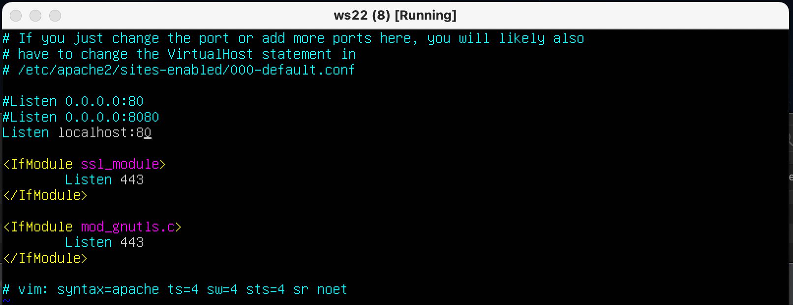

Установим (или проверим что он есть) ssh сервер на машинах.

`sudo apt install openssh-server`

Воспользоваться **Local TCP forwarding** с ws21 до ws22, чтобы получить доступ к веб-серверу на ws22 с ws21.
Для проверки, сработало ли подключение в обоих предыдущих пунктах, перейдите во второй терминал (например, клавишами Alt + F2) и выполните команду.
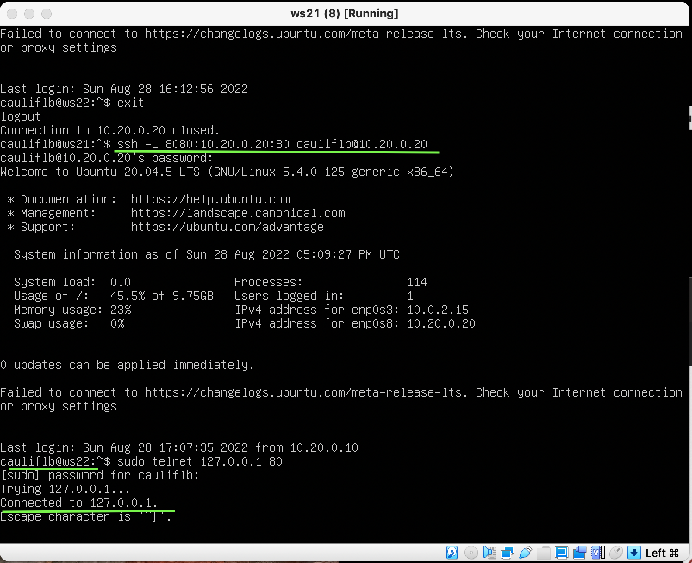
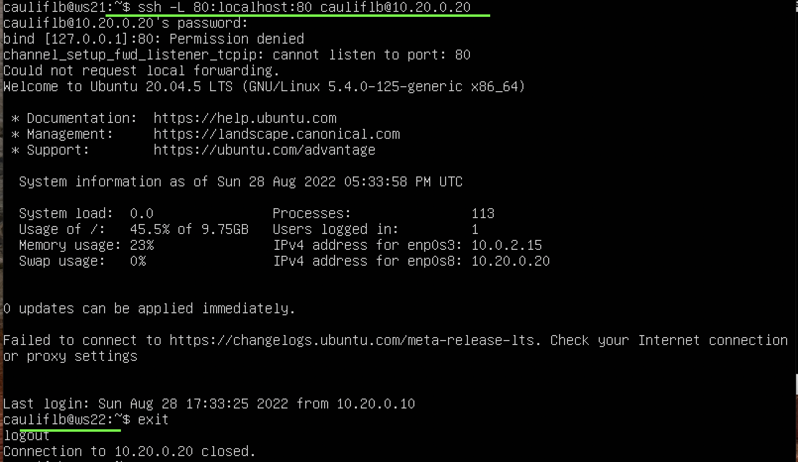

Воспользоваться **Remote TCP forwarding** c ws11 до ws22, чтобы получить доступ к веб-серверу на ws22 с ws11
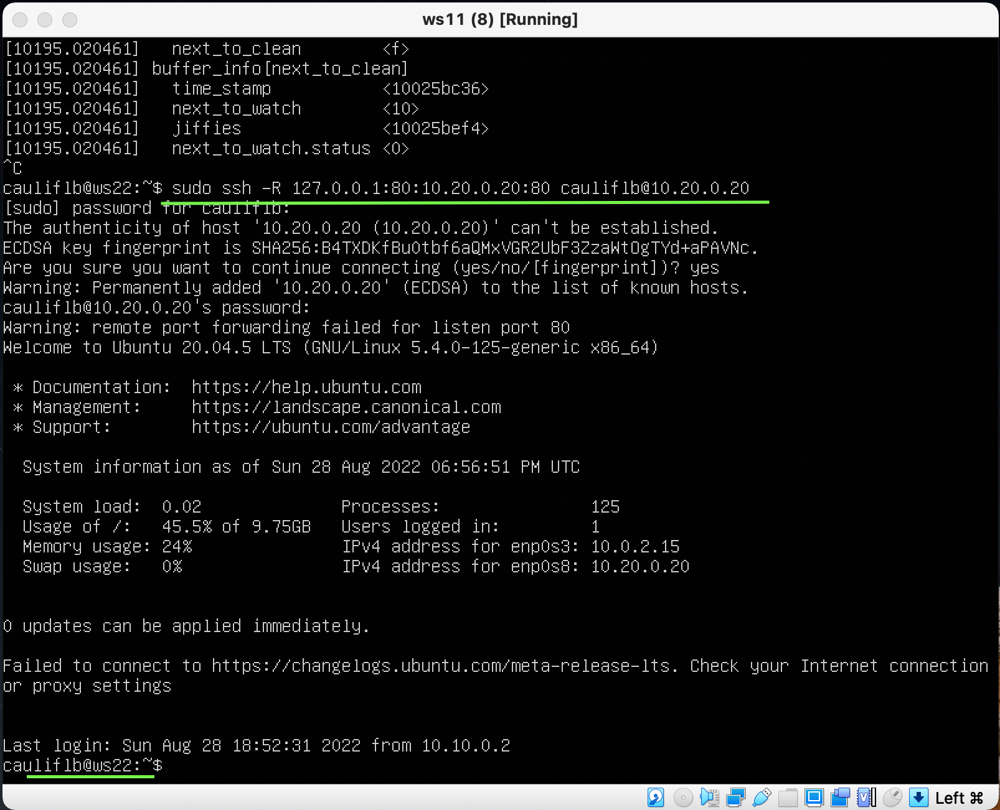

